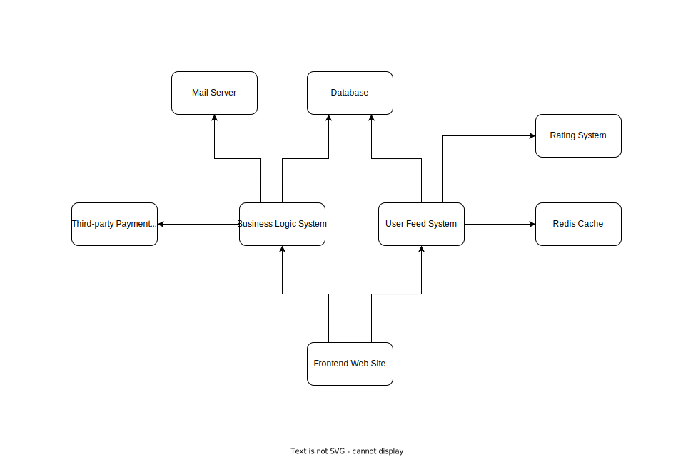

# Trustartup

## Содержание

- [Доменная область](domain.md)
- [Требования](requirements.md)
- [Юзкейсы](use-cases.md)
- [Референсная архитектура](https://github.com/cloudbruh/trustartup#%D1%80%D0%B5%D1%84%D0%B5%D1%80%D0%B5%D0%BD%D1%81%D0%BD%D0%B0%D1%8F-%D0%B0%D1%80%D1%85%D0%B8%D1%82%D0%B5%D0%BA%D1%82%D1%83%D1%80%D0%B0--%D0%BC%D0%B8%D0%BA%D1%80%D0%BE%D1%81%D0%B5%D1%80%D0%B2%D0%B8%D1%81%D1%8B)
- [Диаграмма рабочих потоков](https://github.com/cloudbruh/trustartup#%D0%B4%D0%B8%D0%B0%D0%B3%D1%80%D0%B0%D0%BC%D0%BC%D0%B0-%D1%80%D0%B0%D0%B1%D0%BE%D1%87%D0%B8%D1%85-%D0%BF%D0%BE%D1%82%D0%BE%D0%BA%D0%BE%D0%B2)
- [Компонентная диаграмма](https://github.com/cloudbruh/trustartup#%D0%BA%D0%BE%D0%BC%D0%BF%D0%BE%D0%BD%D0%B5%D0%BD%D1%82%D0%BD%D0%B0%D1%8F-%D0%B4%D0%B8%D0%B0%D0%B3%D1%80%D0%B0%D0%BC%D0%BC%D0%B0)
- [Архитектура в Azure](https://github.com/cloudbruh/trustartup#%D0%B0%D1%80%D1%85%D0%B8%D1%82%D0%B5%D0%BA%D1%82%D1%83%D1%80%D0%B0-%D0%B2-azure)

## Референсная архитектура — микросервисы

Преимущества
- Гибкость
- Разделение ролей
- Использование различных технологий
- Изоляция
- Масштабируемость

Вызовы
- Сложность разработки
- Отсутствие общих стандартов
- Задержки сети
- Необходимость поддержки совместимости

## Диаграмма рабочих потоков

## Компонентная диаграмма

## Архитектура в Azure

