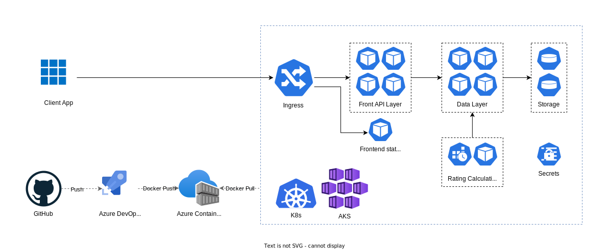

# Развёртывание в Azure

## Диаграмма развёртывания в Azure

### Описание компонентов:

-   GitHub - репозитории Git для хранения кода, конфигураций и манифестов
-   Azure DevOps Pipelines - пайплайны для автоматической сборки и публикации Docker образов
-   Azure Container Registry (trustartup.azurecr.io) - репозиторий для хранения Docker образов
-   Kubernetes (K8s) - система оркестрации контейнеров
-   Azure Kubernetes Service (AKS) - реализация Kubernetes в облаке Azure
-   Ingress - контроллер, распределяющий внешние запросы по нужным сервисам
-   Frontend static - фронтенд приложения
-   Front API Layer (передний слой API) - слой, состоящий из сервисов, непосредственно обрабатывающих запросы от клиента
-   Data Layer (слой данных) - слой, состоящий из сервисов, занимающихся базовыми операциями с данными
-   Rating Calculation Job - периодическая задача, вызывающая пересчет рейтингов
-   Storage - хранилища данных
-   Secrets - секретные данные, хранящиеся в кластере безопасным путём

### Вспомогательные репозитории:

-   Kubernetes - [trustartup-kubernetes](https://github.com/cloudbruh/trustartup-kubernetes) - содержит необходимые Kubernetes манифесты.
