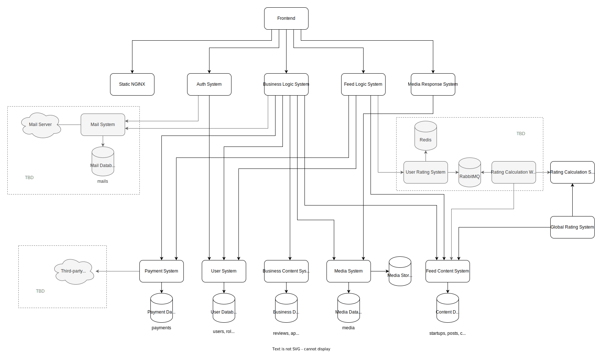

# Микросервисы

## Диаграмма микросервисов

### Список микросервисов:

-   Static NGINX - [trustartup-frontend](https://github.com/cloudbruh/trustartup-frontend) - отдача статики фронтенда
-   Auth System - [trustartup-auth-system](https://github.com/cloudbruh/trustartup-auth-system) - вход, регистрация, выдача токенов
-   Business Logic System - [trustartup-business-logic](https://github.com/cloudbruh/trustartup-business-logic) - обработка форм создания, редактирования, модерации
-   Feed Logic System - [trustartup-feed-logic](https://github.com/cloudbruh/trustartup-feed-logic) - отдача ленты стартапов, постов, обработка лайков и комментариев
-   Media Response System - [trustartup-media-response](https://github.com/cloudbruh/trustartup-media-response) - отдача медиа(картинок, документов, видео)
-   User System - [trustartup-user-system](https://github.com/cloudbruh/trustartup-user-system) - CRUD для пользователей и их ролей
-   Business Content System - [trustartup-business-content](https://github.com/cloudbruh/trustartup-business-content) - CRUD для отзывов, откликов, модераций и наград
-   Media System - [trustartup-media-system](https://github.com/cloudbruh/trustartup-media-system) - обработка и сохранение полученных media
-   Feed Content System - [trustartup-feed-content](https://github.com/cloudbruh/trustartup-feed-content) - CRUD для стартапов, постов, лайков, комментариев, подписок, наград
-   Rating Calculation System - [trustartup-rating-calculation-system](https://github.com/cloudbruh/trustartup-rating-calculation-system) - рассчёт рейтинга стартапа
-   Global Rating System - [trustartup-global-rating](https://github.com/cloudbruh/trustartup-global-rating) - обновление рейтингов стартапов
-   Payment System - [trustartup-payment-system](https://github.com/cloudbruh/trustartup-payment-system) - обработка платежей
-   Mail System - обработка и отправка писем
-   User Rating System - отдача рейтингов для каждого пользователя
-   Rating Calculation Worker - обработка обновлений рейтинга

### Вспомогательные репозитории:

-   Kubernetes - [trustartup-kubernetes](https://github.com/cloudbruh/trustartup-kubernetes) - содержит необходимые Kubernetes манифесты для production режима.
-   Nginx - [trustartup-nginx](https://github.com/cloudbruh/trustartup-nginx) - позволяет запустить весь проект, образы берет из Azure
